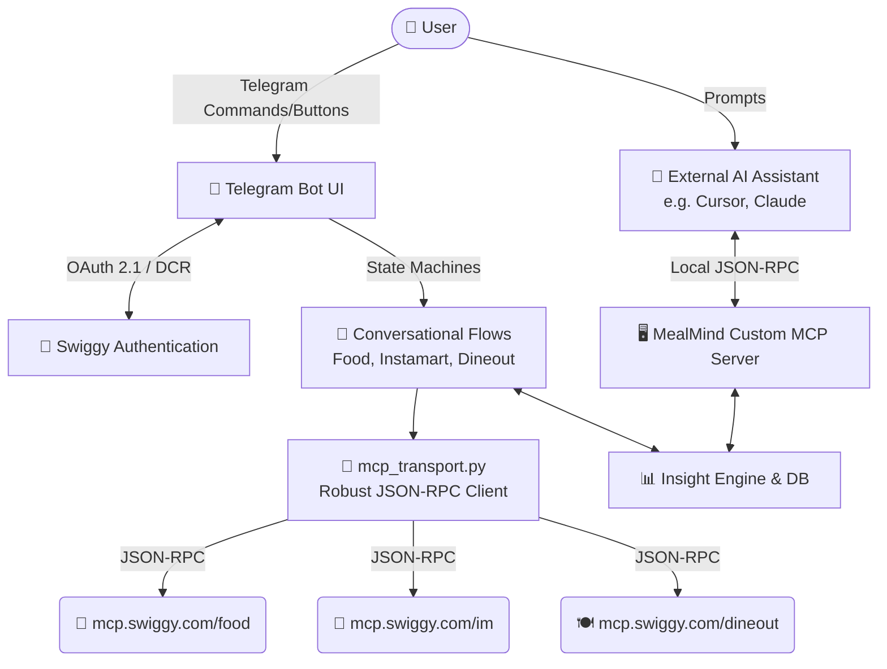

<div align="center">
  <h1>🍽️ MealMind</h1>
  <p><strong>Your Personal Food Intelligence & MCP Swiggy Agent</strong></p>

  <p>
    <a href="https://www.python.org/downloads/"></a>
    <a href="https://fastapi.tiangolo.com/"></a>
    <a href="https://core.telegram.org/bots/api"></a>
    <a href="https://sqlmodel.tiangolo.com/"></a>
    <a href="https://opensource.org/licenses/MIT"></a>
  </p>
</div>

---

## 📖 Overview

**MealMind** is a comprehensive, AI-powered food intelligence agent built around the Swiggy ecosystem (Food Delivery, Instamart Groceries, and Dineout Reservations). 

By integrating directly with Swiggy's official **Builders Club Model Context Protocol (MCP) servers**, MealMind allows you to order food, buy groceries, book tables, and analyze your spending habits entirely from a seamless **Telegram conversational interface** or from your favorite AI IDE (like Cursor/Claude Desktop).

---

## ✨ Core Ecosystem Capabilities

| Vertical | Features | Status |
| :--- | :--- | :---: |
| 🍕 **Food Delivery** | Restaurant search, interactive menus, cart management, and seamless Telegram checkout (UPI/Cash). | ✅ |
| 🥦 **Instamart** | Grocery product search, variation parsing, isolated cart session, and order placement. | ✅ |
| 🍽️ **Dineout** | Location-based venue search, dynamic date/time slot fetching, guest count configuration, and secure table booking. | ✅ |
| 🧠 **Intelligence** | Background syncing of order history, peak ordering analytics, monthly trend analysis, and custom insights engine. | ✅ |

---

## 🏗️ System Architecture

MealMind operates with a dual-architecture design. It **consumes** Swiggy's external MCP servers to execute real-world actions, while simultaneously acting as its **own Custom MCP Server** to serve analytics back to external AI agents.



### 🧩 Component Breakdown

1. **Presentation Layer (Telegram UI)**
   - Built on `python-telegram-bot` leveraging `ConversationHandler`.
   - `food_ordering_flow.py`, `instamart_ordering_flow.py`, and `dineout_booking_flow.py` act as completely isolated state machines ensuring robust UX without cross-contamination.

2. **Swiggy Integration Layer**
   - **`mcp_transport.py`**: A hardened generic HTTP/JSON-RPC client that handles strict `asyncio` timeouts, exception translation, and varied content extraction formats.
   - **Wrappers**: `swiggy_mcp_client.py`, `swiggy_instamart_mcp.py`, and `swiggy_dineout_mcp.py` provide strongly-typed async functions for every official Swiggy tool.

3. **Data, Analytics & Security**
   - **Dynamic Client Registration (`dcr.py`)**: Automatically negotiates and registers the OAuth client with Swiggy on startup.
   - **Token Encryption (`security.py`)**: OAuth tokens (`SwiggyConnection`) are encrypted at rest using `cryptography.fernet`.
   - **`insight_engine.py`**: Aggregates SQLite historical data to rank top dishes, analyze peak hours, and generate LLM-friendly insight reports.

---

## 🚀 Getting Started

### 1. Prerequisites
- **Python 3.10+**
- A **Telegram Bot Token** (Create one via [@BotFather](https://t.me/BotFather))
- (Local Testing) A tunneling service like **ngrok** to receive OAuth callbacks.

### 2. Environment Configuration
Create a `.env` file in the project root:

```env
# Environment (development or production)
ENVIRONMENT=development

# Telegram Bot Token
TELEGRAM_TOKEN=your_telegram_bot_token_here

# FastAPI Webhook/OAuth Settings
PORT=8000
# IMPORTANT: This must match your public tunneling URL for OAuth to succeed.
SWIGGY_REDIRECT_URI=https://your-ngrok-url.app/api/auth/swiggy/callback

# (Required in Production) Base64 URL-safe string for encrypting DB tokens
# ENCRYPTION_KEY=... 
```

### 3. Installation & Boot
```bash
# Clone the repository
git clone https://github.com/yourusername/mealmind.git
cd mealmind

# Create and activate a virtual environment
python -m venv .venv
source .venv/bin/activate  # On Windows: .venv\Scripts\activate

# Install dependencies
pip install -r requirements.txt

# Start the unified server (FastAPI + Telegram Bot)
python -m src.main
```

### 4. Connect & Play
1. Open your bot in Telegram and send `/start`.
2. Click **Connect Swiggy** to initiate the secure OAuth flow.
3. Once authenticated, explore the interactive menus to order food, book tables, or view your personal food insights!

---

## 🛡️ Security & Tenant Isolation

Enterprise-grade security is baked into MealMind:
- **Zero-Leakage Design:** The `get_user_access_token(telegram_id)` strictly isolates sessions. One user cannot trigger orders or view data on another user's Swiggy account.
- **Encrypted Storage:** User tokens are never stored in plaintext. They are encrypted at rest using Fernet symmetric encryption.
- **Explicit Consent:** No automatic order placement or table booking is permitted by the system. The bot explicitly renders cart totals and requires a final tap confirmation before triggering any state-mutating MCP commands (e.g. `checkout` or `book_table`).

---

## 🧪 Testing

MealMind ships with a comprehensive mock testing suite that verifies state machine transitions, edge cases, and MCP error handling without hitting production endpoints.

```bash
# Install test dependencies
pip install pytest pytest-asyncio

# Run the test suite (67+ passing tests)
pytest -v
```

---

## 🤝 Contributing

Contributions are welcome! Whether it's adding a new Swiggy vertical, improving the insights engine, or squashing bugs:
1. Fork the project
2. Create your Feature Branch (`git checkout -b feature/AmazingFeature`)
3. Commit your Changes (`git commit -m 'feat: Add some AmazingFeature'`)
4. Ensure tests pass (`pytest`)
5. Push to the Branch (`git push origin feature/AmazingFeature`)
6. Open a Pull Request

---

## 📄 License

Distributed under the MIT License. See `LICENSE` for more information.
